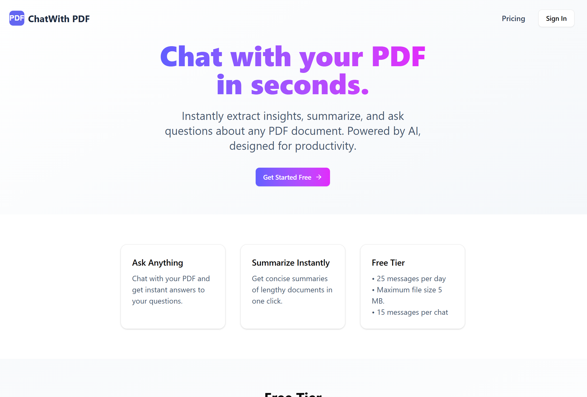

# Chat with PDF

Chat with your PDF using RAG (Retrieval Augmented Generation) powered by Vercel AI SDK, Pinecone, Groq and JINA Embeddings Provider with Clerk for authentication, Supabase for storage, and Postgres as the primary database.



## Overview

**Chat with PDF** is a web app that allows users to upload a single PDF and have a conversational experience with it.

Features:

- Upload a PDF and start chatting with it.
- Authenticated access via Clerk.
- Data stored in PostgreSQL.
- Vector embeddings managed via Pinecone.
- Secure and efficient PDF uploads using Supabase Storage signed URLs.
- PDFs processed with LangChain's text splitter (2000-character chunks).
- Rate-limited free-tier usage with:
  - ⛔ Max 25 messages/day per user.
  - ⛔ Max 15 messages per individual PDF chat.

> Note: Supports chatting with one PDF at a time. Best used as a lightweight mini-RAG app.

---

## Demo Video

Watch a quick demo of **Chat with PDF** in action:

https://github.com/user-attachments/assets/2467120d-8edf-4d5b-8496-86e42d07056d

## Tech Stack

- **Framework**: Next.js (App Router)
- **Auth**: Clerk Auth
- **Storage**: Supabase Bucket + Signed URLs, SQL Database
- **Vector DB**: Pinecone
- **RAG Framework**: Vercel AI SDK, Groq and Langchain
- **Database**: PostgreSQL via Prisma ORM
- **Rate Limiting**: Message counting using DB queries
- **PDF Parsing**: PDF parser and text splitter (2000-character chunks) using Langchain

---

## Local Development Setup

### 1. Clone the Repository

```bash
git clone https://github.com/manojbaniya444/Chat-RAG.git
cd Chat-RAG
```

### 2. Install Dependencies

```bash
npm install
```

### 3. Fill the .env.example and rename it to .env

Includes all the API keys and Tokens

### 4. Set Up Prisma

```bash
npx prisma generate
```

### 5. Run Database Migrations

```bash
npx prisma migrate dev
```

### 6. Include Clerk `user.created` webhook endpoint.

```js
In clerk config add your local endpoint: `<tunnel_ngrok_base_url>/api/clerk/webhook`
```

### 7. Start Development Server

```bash
npm run dev
```

## Design

**Secure Uploads with Signed URL**
Supabase's signed URL mechanism ensures the PDF upload process is secure and efficient without exposing public access.

**Efficient Chunking and Retrieval**
Uploaded PDFs are processed using Langchains text splitter with 2000 character chunks to balance retrieval performance and context size.

**Basic Rate Limiting**
Each user is limited to 25 messages per day and 15 messages per PDF chat.

**Auth with Clerk**
Clerk is seamlessly integrated with NEXT js to handle user auth and it is secure easy to manage and well suited for next js projects.

## Improvements to be made:

- Async Queues (e.g BullMQ, RabbitMQ or any Queue) to process PDF ingestion and embedding for better scalability.

- Server actions for the chat component which now is built with traiditional React based Client Component (can Improve performance and better user experience)

- Redis in memory data store to limit user instead of performing db query to count messages count. But for simplicity used db query.

- Multi-PDF converstaions for more advance document based chat sessions.
